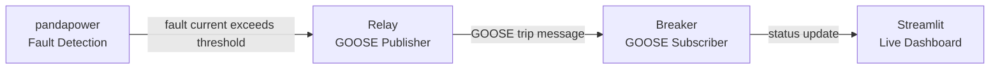

# IEC 61850 Substation Automation

End-to-end GOOSE/MMS protection pipeline that links fault current detection to automatic relay-breaker tripping, with real-time visualization on a live dashboard. Built to demonstrate substation protection automation using industry-standard IEC 61850 communication.

 

## Architecture

## How it works

1. **Fault detection** - A 132kV/11kV substation model (pandapower) runs a 3-phase short-circuit calculation. If fault current exceeds a threshold, a trip condition is triggered.
2. **GOOSE protection signaling** - The relay (IED-1) publishes an IEC 61850 GOOSE trip message over the network using `libiec61850`.
3. **Breaker response** - The breaker (IED-2) subscribes to GOOSE messages and trips in real time on receipt.
4. **Live monitoring** - A Streamlit dashboard displays relay/breaker status, an event log, and a fault current graph.

## Result

End-to-end fault-to-trip time measured at approximately 40 ms in this simulated environment (software/WSL loopback - real hardware relays achieve ~4 ms).

| Stage | Time |
|---|---|
| Fault detection (pandapower) | ~15 ms |
| GOOSE publish | ~16 ms |
| Network delivery to breaker | ~12 ms |
| **Total (fault to trip)** | **~40 ms** |

## Built from these components

| Component | Description | Repo |
|---|---|---|
| GOOSE Relay-Breaker Communication | Publisher-subscriber IEDs exchanging GOOSE trip signals over the network | [goose-relay-breaker](https://github.com/muhammadshahzaibshahzaib92-dev/goose-relay-breaker) |
| Fault-to-GOOSE Protection Logic | Links pandapower fault current detection to automatic GOOSE trip triggering | [fault-to-goose-integration](https://github.com/muhammadshahzaibshahzaib92-dev/fault-to-goose-integration) |
| Substation Live Monitoring Dashboard | Real-time relay/breaker status, event log, and fault graph in browser | [substation-monitoring-dashboard](https://github.com/muhammadshahzaibshahzaib92-dev/substation-monitoring-dashboard) |

## Tools

libiec61850, pandapower, streamlit, Python

## Author

Muhammad Shahzaib - Electrical Engineer (Power)
